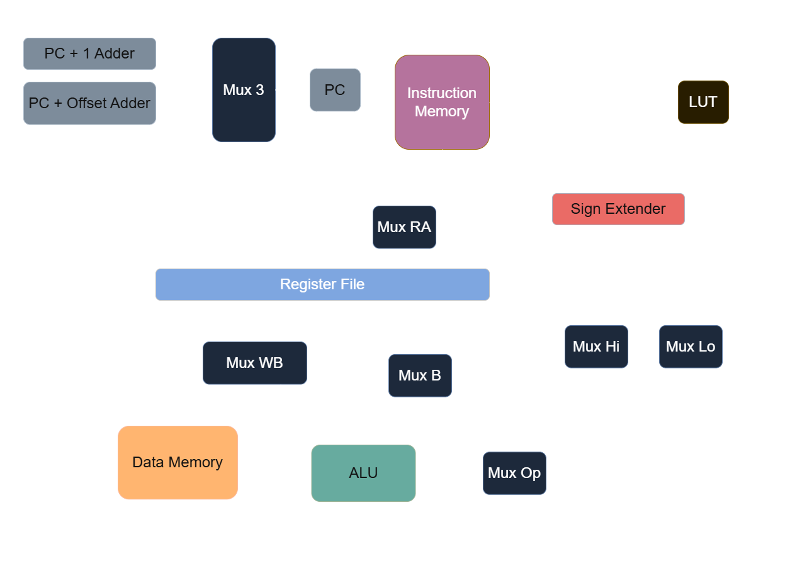

# Verilog 16-Bit CPU

  

A 16-bit CPU designed and built from scratch on a Digilent Basys 3 — custom instruction set, hand-drawn datapath, single-cycle, written in plain Verilog. Not a softcore port and not a RISC-V implementation: the point is designing the architecture, not transcribing someone else's spec.

## Approach

Learning FPGA design from zero, one rung at a time. Every phase has a gate that has to pass before the next one starts — the toolchain gets proven with a blinking LED before any logic is designed, blocks get simulated before they're synthesized, and the instruction set gets written on paper before any RTL exists. Nothing is built on an unproven layer.

## Hardware

- Digilent Basys 3 — Xilinx Artix-7 XC7A35T-1CPG236C
- ~20,800 LUTs, ~41,600 flip-flops, 1.8 Mb block RAM
- 100 MHz onboard oscillator
- 16 switches, 16 LEDs, 4-digit 7-segment, 5 buttons
- Built-in USB-UART bridge — the output path once programs are running
- Vivado ML Standard, Verilog

## Status

- Phase 0 — Toolchain + flash pipeline ✅ (2026-07-29 — blink running on hardware)
- Phase 1 — HDL fundamentals, simulation-first ✅ (2026-08-01 — blocks simulated, mux confirmed on hardware)
- Phase 2 — ISA + datapath on paper, no RTL ✅ (2026-08-02 — 16 instructions, datapath drawn)
- Phase 3 — Datapath blocks, each with its own testbench ✅ (2026-08-06 — six blocks, six testbenches)
- Phase 4 — Control unit + single-cycle integration ✅ (2026-08-09 — CPU runs programs in simulation)
- Phase 5 — On-hardware bring-up, state observable over UART ⬜
- Phase 6 — Python assembler, demo program ⬜

Locked so far: single-cycle before anything else (pipelining is explicitly out of scope for now), Harvard memory model, 8 registers, 16 instructions across four formats.

## Phase 1 — Simulation

A 2:1 mux, an 8-bit register, a 2→4 decoder, and an 8-bit ALU, each testbenched and read in the waveform viewer before anything reached the board.

Choosing test operands turned out to be the real skill. Driving the ALU with `a=08, b=08` makes AND and OR return the same value; fix that with `a=08, b=04` and `a+b` collides with `a|b` instead, because operands sharing no bits generate no carries. A testbench that can't tell a right answer from a wrong one passes either way — which became the theme of the whole project.

## Phase 2 — Instruction Set

Sixteen bits doesn't leave much room, so most of the ISA decided itself. Sixteen registers would need 4-bit fields three times over, leaving exactly 16 opcodes — full before a single instruction is named — so 8 registers. Opcode width was the real corner: five bits shrinks the immediate to ±16, three bits allows only 8 instructions, and neither works. But an R-type uses only 13 of its 16 bits, so three sit idle on every arithmetic instruction. Handing those three the job of picking *which* ALU operation puts all eight under one opcode, freeing 15 patterns and keeping the wide immediate. It's MIPS's funct field; I got there by staring at the unused bits.

```
R:  op(4)  rd(3)  rs(3)  rt(3)  funct(3)     add sub and or xor not shl shr
I:  op(4)  rd(3)  rs(3)  imm(6)              addi lw sw beq bne blt
J:  op(4)  addr(12)                          j
LI: op(4)  rd(3)  sel(1) imm8(8)             li
```



Drawing the datapath is what audits the encoding. `rd` and `rs` sit at the same bits in every format that uses them, so those wires run straight to the register file — two muxes that never had to be built. The five left over are the control unit's entire job, and one of them I missed on the first pass: wiring `funct` straight to the ALU works until an instruction has no funct field, and then `addi r1, r2, 5` leaves the immediate's low bits on those wires and the CPU quietly executes whatever the constant spells. There is no default in hardware.

## Phase 3 — Datapath Blocks

Six blocks in `rtl/` with a testbench each in `tb/` — ALU, sign extender, register file, PC, instruction memory, data memory. No top-level module yet; that's Phase 4.

Verilog doesn't reject a width mistake, it truncates. Writing the ALU's case labels as `2'b000` through `2'b111` — a 2-bit size on 3-bit values — collapsed eight cases onto four, leaving xor, not and both shifts unreachable. Half the ALU was dead, and it elaborated with no error and no warning.

The habit that caught the rest was predicting every waveform value before running the simulation. Two finds justify it: the PC's adders were written inside the clocked block, which stores instead of computes, so the PC would have advanced once every two clocks and run every instruction twice — and the first data-memory testbench wrote one address, moved on, and never came back, meaning a memory with no address decoding at all would have passed it.

## Phase 4 — Control Unit + Integration

The decoder, a top-level module wiring all seven blocks and four muxes, and four hand-assembled test programs — arithmetic, memory, control flow, and a sum loop. `cpu_top` holds no state and makes no decisions; every `reg` in the finished design sits inside a block that was gated on its own.

The synthesis check was worth nothing for most of a day. It asks for zero inferred latches, and a top module whose outputs go nowhere synthesizes to nothing at all — zero LUTs, zero flip-flops, therefore zero latches, reported as a clean pass on an empty design. The fix is to expose a signal sitting downstream of everything, so the machine has to exist in order to produce it. Even then the count came back at 51 flip-flops against a hand-derived 144, because the program is baked into the ROM at synthesis time and the tools constant-fold straight through it — nothing in that program writes data memory, so the entire 256-word array was deleted.

The last test program wrote the project's theme one more time. The first version of the sum loop ran until the running total reached 55 and then stopped, which makes the answer the exit condition: a broken adder could only ever have caused a hang, never a wrong number. Exiting on the loop counter instead leaves the total free to be wrong.

## Repo Structure

```
fpga-16bit-cpu/
├── rtl/               # CPU source
├── tb/                # Testbenches
├── programs/          # Hand-assembled programs
├── phase0-blink/      # First working bitstream
├── phase1-sim/        # Early HDL exercises
├── constraints/       # Digilent Basys 3 master XDC
└── docs/              # Datapath diagram, ISA + port map data sheet
```

Vivado project directories are gitignored — they're regenerated by synthesis and accounted for 98% of the Phase 0 project's size. Only sources and constraints are tracked.

## Author

Rohaan Brar — digital design learning project, Purdue CompE.
